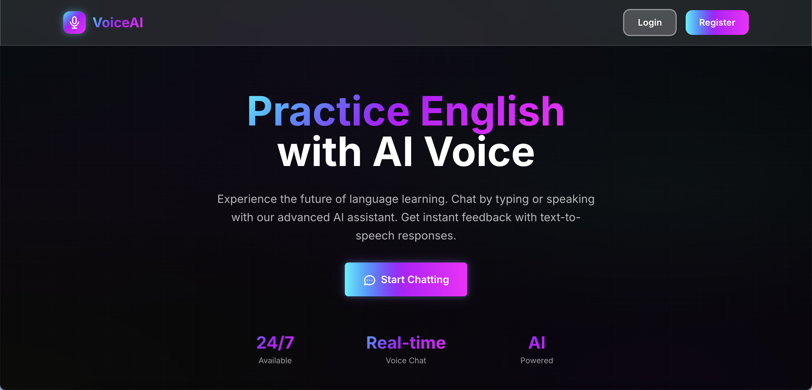
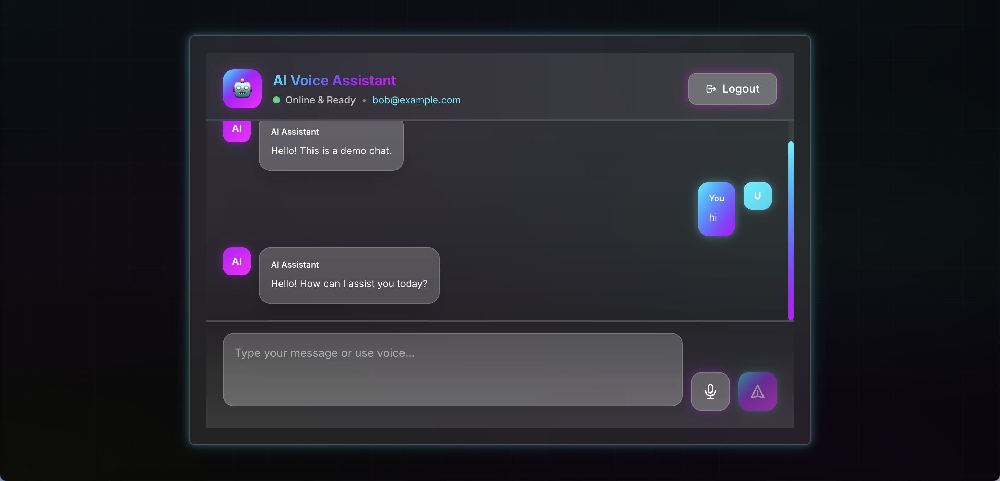
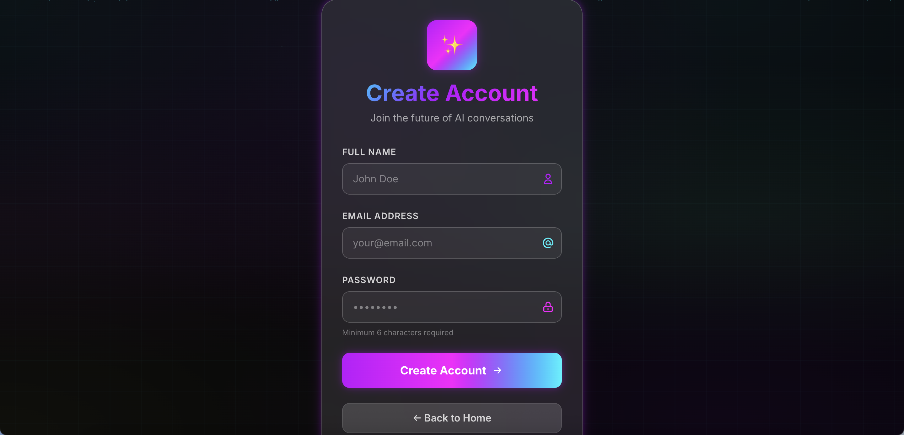
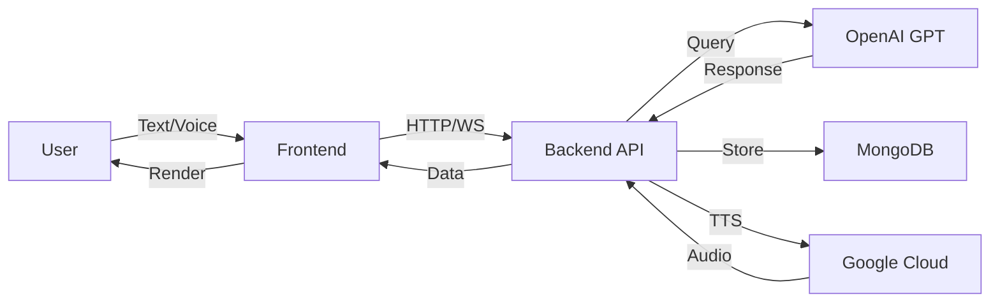

<div align="center">

# 🎙️ AI Voice Chat Assistant

### *Real-time Voice & Text Conversations with AI*

[](https://reactjs.org/)
[](https://nodejs.org/)
[](https://www.mongodb.com/)
[](https://openai.com/)
[](LICENSE)
[](CONTRIBUTING.md)

**[Features](#-features)** •
**[Demo](#-screenshots)** •
**[Quick Start](#-quick-start)** •
**[Documentation](#-api-documentation)** •
**[Contributing](#-contributing)**

</div>

---

## 📖 Overview

A cutting-edge, full-stack AI chat application featuring **real-time voice & text communication**, powered by OpenAI GPT-3.5-turbo. Built with modern web technologies and following **clean code principles** with MVC architecture.

### 🎯 Perfect For
- Learning full-stack development with AI integration
- Building voice-enabled chatbots
- Understanding WebRTC and real-time communication
- Exploring modern React patterns and custom hooks
- Implementing secure authentication flows


---

## ✨ Features

<table>
<tr>
<td width="50%">

### 🤖 **AI Capabilities**
- ✅ OpenAI GPT-3.5-turbo integration
- ✅ Context-aware conversations
- ✅ Natural language processing
- ✅ Intelligent response generation

### 🎤 **Voice Features**
- ✅ Real-time voice recording
- ✅ Speech-to-text (Google Cloud)
- ✅ Text-to-speech playback
- ✅ WebRTC audio streaming

</td>
<td width="50%">

### 🔐 **Security & Auth**
- ✅ JWT authentication
- ✅ Secure password hashing
- ✅ Protected API routes
- ✅ Token-based sessions

### � **Modern UI/UX**
- ✅ Cyber-futuristic design
- ✅ Glassmorphism effects
- ✅ Smooth animations (Framer Motion)
- ✅ Fully responsive layout
- ✅ Loading indicators
- ✅ Typing animations

</td>
</tr>
</table>

---

## 🖼️ Screenshots

<div align="center">

### 🏠 Home Page

*Futuristic landing page with animated background and smooth transitions*

### 💬 Chat Interface

*Real-time chat with AI assistant, voice controls, and typing animations*

### 🔑 Authentication

*Secure login and registration with beautiful glassmorphism design*

</div>

> **Note:** Screenshots are illustrative. The actual UI features neon gradients, particle effects, and cyber grid animations.

---


---

## 🏗️ Architecture

### 🎨 **Tech Stack**

<table>
<tr>
<td width="50%" valign="top">

#### **Frontend**
```
├── React 18
├── Vite
├── Tailwind CSS
├── Framer Motion
├── Socket.IO Client
└── WebRTC API
```

</td>
<td width="50%" valign="top">

#### **Backend**
```
├── Node.js 18
├── Express.js
├── MongoDB + Mongoose
├── Socket.IO
├── JWT
├── OpenAI API
└── Google Cloud Speech
```

</td>
</tr>
</table>

### 📂 **Project Structure**

<details>
<summary><b>Backend (MVC Pattern)</b></summary>

```
server/
├── 📁 config/              # Application configuration
│   ├── constants.js       # App-wide constants
│   ├── database.js        # MongoDB connection
│   └── env.js             # Environment variables
├── 📁 controllers/         # Request handlers
│   ├── authController.js  # Authentication logic
│   ├── chatController.js  # Chat operations
│   └── socketController.js # WebRTC signaling
├── 📁 services/            # Business logic
│   ├── gptService.js      # OpenAI integration
│   ├── sttService.js      # Speech-to-Text
│   ├── ttsService.js      # Text-to-Speech
│   └── socketService.js   # WebRTC signaling
├── 📁 middleware/          # Express middleware
│   ├── auth.js            # JWT verification
│   └── errorHandler.js    # Error handling
├── 📁 models/              # Database models
│   └── User.js            # User schema
├── 📁 routes/              # API routes
│   ├── auth.js            # Auth endpoints
│   └── chat.js            # Chat endpoints
└── 📄 index.js             # Main entry point
```

</details>

<details>
<summary><b>Frontend (Component-Based)</b></summary>

```
src/
├── 📁 services/            # API & Business logic
│   ├── apiService.js      # HTTP requests
│   ├── authService.js     # Authentication
│   ├── audioService.js    # Audio recording/playback
│   └── socketService.js   # WebRTC & Socket.IO
├── 📁 hooks/               # Custom React hooks
│   ├── useAuth.js         # Authentication state
│   ├── useChat.js         # Chat functionality
│   ├── useAudioRecording.js
│   ├── useAudioPlayback.js
│   └── useTypingAnimation.js
├── 📁 components/          # UI components
│   ├── ChatPage.jsx       # Main chat interface
│   ├── LoginForm.jsx      # Login form
│   ├── RegisterForm.jsx   # Registration form
│   └── Home.jsx           # Landing page
├── 📁 react-bits/          # Reusable UI components
│   └── index.jsx          # Card, Button, Input, etc.
└── 📄 App.jsx              # Main app component
```

</details>

### 🔄 **Data Flow**



---


---

## 🚀 Quick Start

### 📋 Prerequisites

Before you begin, ensure you have:

```bash
✓ Node.js 18+ installed
✓ MongoDB running (Docker or local)
✓ OpenAI API Key
✓ Google Cloud credentials (optional, for voice features)
```

### ⚡ Installation

#### 1️⃣ **Clone the Repository**

```bash
git clone https://github.com/canuzlas/realtime-voicechat-with-ai-wtrc-tts-stt.git
cd realtime-voicechat-with-ai-wtrc-tts-stt
```

#### 2️⃣ **Backend Setup**

```bash
cd server

# Copy environment file
cp .env.example .env

# Install dependencies
npm install

# Edit .env and add your credentials:
# - MONGODB_URI
# - JWT_SECRET
# - OPENAI_API_KEY (required)
# - GOOGLE_APPLICATION_CREDENTIALS (optional)
```

#### 3️⃣ **Frontend Setup**

```bash
cd ..

# Copy environment file
cp .env.example .env

# Install dependencies
npm install

# Edit .env and set:
# VITE_API_URL=http://localhost:3000
```

#### 4️⃣ **Start with Docker** 🐳 *(Recommended)*

```bash
cd server
docker compose up -d
```

This starts MongoDB and the backend server. Then start the frontend:

```bash
cd ..
npm run dev
```

✨ **Open** [http://localhost:5173](http://localhost:5173)

#### 5️⃣ **Or Run Locally**

```bash
# Terminal 1 - MongoDB
docker run -d -p 27017:27017 --name mongodb mongo:6.0

# Terminal 2 - Backend
cd server
npm start

# Terminal 3 - Frontend
npm run dev
```

---

## 🔑 Environment Variables

### Backend (`server/.env`)

| Variable | Required | Description | Example |
|----------|----------|-------------|---------|
| `PORT` | No | Server port | `3000` |
| `MONGODB_URI` | Yes | MongoDB connection string | `mongodb://localhost:27017/voice-chat` |
| `JWT_SECRET` | Yes | Secret for JWT signing | `your-super-secret-key-here` |
| `OPENAI_API_KEY` | Yes | OpenAI API key | `sk-...` |
| `GOOGLE_APPLICATION_CREDENTIALS` | No | Path to Google Cloud credentials | `./google-credentials.json` |
| `NODE_ENV` | No | Environment | `development` or `production` |

### Frontend (`.env`)

| Variable | Required | Description | Example |
|----------|----------|-------------|---------|
| `VITE_API_URL` | Yes | Backend API URL | `http://localhost:3000` |

> 💡 **Tip:** Use `openssl rand -base64 32` to generate a secure JWT_SECRET

---


---

## 📡 API Documentation

### 🔐 **Authentication Endpoints**

#### Register User
```http
POST /auth/register
Content-Type: application/json

{
  "name": "John Doe",
  "email": "john@example.com",
  "password": "securepass123"
}
```

#### Login
```http
POST /auth/login
Content-Type: application/json

{
  "email": "john@example.com",
  "password": "securepass123"
}
```

**Response:**
```json
{
  "token": "eyJhbGciOiJIUzI1NiIsInR5cCI6IkpXVCJ9...",
  "user": {
    "id": "507f1f77bcf86cd799439011",
    "name": "John Doe",
    "email": "john@example.com"
  }
}
```

### � **Chat Endpoints**

#### Send Text Message
```http
POST /chat/message
Authorization: Bearer <token>
Content-Type: application/json

{
  "message": "Hello, AI assistant!"
}
```

#### Send Voice Message
```http
POST /chat/voice
Authorization: Bearer <token>
Content-Type: multipart/form-data

audio: <audio file>
```

#### Request Text-to-Speech
```http
POST /chat/tts
Authorization: Bearer <token>
Content-Type: application/json

{
  "text": "Hello, how are you?"
}
```

### 🔌 **Socket.IO Events**

#### Client → Server
```javascript
// Join a room
socket.emit('join', { room: 'room-id' })

// Send WebRTC offer
socket.emit('offer', { offer, to: 'peer-id' })

// Stream audio chunk
socket.emit('stream-audio', audioBuffer)

// Finalize audio stream
socket.emit('finalize-audio')
```

#### Server → Client
```javascript
// Peer joined notification
socket.on('peer-joined', ({ peerId }) => {})

// Receive WebRTC answer
socket.on('answer', ({ answer, from }) => {})

// Receive transcription
socket.on('transcription', ({ text }) => {})

// Receive TTS audio chunk
socket.on('tts-chunk', (chunk) => {})
```

---


---

## 🎨 UI Components Library

### **React Bits** - Custom Component System

Pre-built, reusable components with cyber-futuristic styling:

```jsx
// Cards with glassmorphism
<Card className="glass-strong neon-glow-blue">
  Content here
</Card>

// Gradient buttons
<Button variant="primary" className="btn-cyber">
  Click Me
</Button>

// Styled inputs
<Input 
  placeholder="Enter text" 
  className="input-glow"
/>

// Animated backgrounds
<Background variant="vivid" />

// Avatars
<Avatar src="/avatar.jpg" size="lg" />

// Icon buttons
<IconButton icon="microphone" variant="danger" />
```

### **Built-in Animations**

| Animation | Usage | Description |
|-----------|-------|-------------|
| `animate-gradient-xy` | Gradient movement | Smooth gradient transitions |
| `animate-pulse-glow` | Neon pulsing | Glowing neon effect |
| `animate-slide-up` | Slide animation | Smooth entrance from bottom |
| `animate-pulse-record` | Recording indicator | Red pulsing animation |
| `neon-glow-blue` | Blue glow | Neon blue shadow effect |
| `glass-strong` | Glassmorphism | Frosted glass effect |

---

## 🧪 Development & Testing

### Run Tests
```bash
# Backend tests
cd server
npm test

# Frontend tests
npm test
```

### Development Mode
```bash
# Backend with hot reload
cd server
npm run dev

# Frontend with HMR
npm run dev
```

### Build for Production
```bash
# Frontend build
npm run build

# Preview production build
npm run preview
```

### Code Quality
```bash
# Lint code
npm run lint

# Format code
npm run format
```

---

## � Troubleshooting

<details>
<summary><b>Port Already in Use</b></summary>

```bash
# Kill process on port 3000
lsof -ti:3000 | xargs kill -9

# Kill process on port 5173
lsof -ti:5173 | xargs kill -9
```

</details>

<details>
<summary><b>MongoDB Connection Failed</b></summary>

```bash
# Check if MongoDB is running
docker ps | grep mongo

# Restart MongoDB
docker restart mongodb

# Check logs
docker logs mongodb
```

</details>

<details>
<summary><b>Voice Recording Not Working</b></summary>

- ✓ Check microphone permissions in browser settings
- ✓ Use HTTPS in production (required for getUserMedia API)
- ✓ Verify Google Cloud credentials are configured
- ✓ Check browser console for errors

</details>

<details>
<summary><b>CORS Errors</b></summary>

Add your frontend URL to backend CORS configuration:

```javascript
// server/index.js
app.use(cors({
  origin: ['http://localhost:5173', 'https://yourdomain.com'],
  credentials: true
}))
```

</details>

---

## 🚀 Deployment

### **Frontend (Vercel/Netlify)**

```bash
# Build
npm run build

# Deploy to Vercel
vercel deploy

# Or deploy to Netlify
netlify deploy --prod
```

### **Backend (Railway/Render/Heroku)**

```bash
# Ensure environment variables are set
# Deploy to Railway
railway up

# Or deploy to Render
# Connect your GitHub repo and set build command: npm install
```

### **MongoDB (MongoDB Atlas)**

1. Create account at [mongodb.com/cloud/atlas](https://www.mongodb.com/cloud/atlas)
2. Create cluster
3. Get connection string
4. Update `MONGODB_URI` in your environment

---

## 🤝 Contributing

We love contributions! 🎉

### How to Contribute

1. **Fork** the repository
2. **Create** your feature branch (`git checkout -b feature/AmazingFeature`)
3. **Commit** your changes (`git commit -m 'Add some AmazingFeature'`)
4. **Push** to the branch (`git push origin feature/AmazingFeature`)
5. **Open** a Pull Request

### Development Guidelines

- ✅ Follow existing code style
- ✅ Write meaningful commit messages
- ✅ Add comments for complex logic
- ✅ Test your changes thoroughly
- ✅ Update documentation if needed

---

## 📄 License

This project is licensed under the **MIT License** - see the [LICENSE](LICENSE) file for details.

---

## 🙏 Acknowledgments

- [OpenAI](https://openai.com/) - For GPT-3.5-turbo API
- [Google Cloud](https://cloud.google.com/) - For Speech services
- [Tailwind CSS](https://tailwindcss.com/) - For styling
- [Framer Motion](https://www.framer.com/motion/) - For animations
- [Socket.IO](https://socket.io/) - For real-time communication
- All open-source contributors

---

## 📞 Support & Contact

- **Issues:** [GitHub Issues](https://github.com/canuzlas/realtime-voicechat-with-ai-wtrc-tts-stt/issues)
- **Discussions:** [GitHub Discussions](https://github.com/canuzlas/realtime-voicechat-with-ai-wtrc-tts-stt/discussions)
- **Email:** canuzlass@gmail.com

---

<div align="center">

### ⭐ Star this repo if you find it useful!

Made with ❤️ by **[Can Uzlas](https://github.com/canuzlas)**

**[⬆ Back to Top](#-ai-voice-chat-assistant)**

</div>
